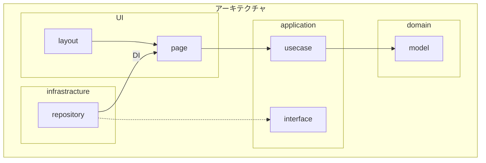

# dev_windows_app

### tree

```
├─app
│  ├─assets
│  │  ├─data
│  │  └─images
│  ├─config
│  │  └─__pycache__
│  ├─module
│  │  ├─model
│  │  ├─repository
│  │  ├─service
│  │  ├─usecase
│  │  └─utility
│  └─ui
│      ├─layout
│      │  └─__pycache__
│      ├─page
│      │  └─__pycache__
│      ├─route
│      │  └─__pycache__
│      ├─widget
│      │  └─__pycache__
│      └─__pycache__
├─build
│  └─main
│      └─localpycs
├─dist
├─docs
├─logs
├─scripts
│  ├─linux
│  └─windows
└─venv

```

```shell
Python -V 3.12.5
```



### 参考にしたレイアウトのコード

[公式の example](https://github.com/TomSchimansky/CustomTkinter/blob/master/examples/image_example.py)
